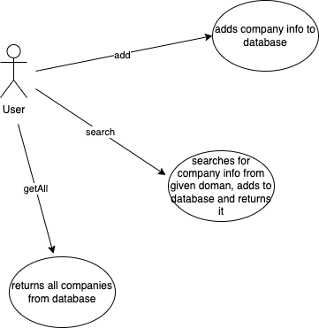

# Midterm OOP

Authors: Пеняга Назарій, Петричко Віталій, Ніколайченко Іван, Омельчук Олег

## Tasks

Our tasks were to create:

●  Use Case Diagram (1 point) 

●  Class Diagram (1 point) 

● Code (3 points)

● Demo (3 points)

● Used patterns description (2 points)

